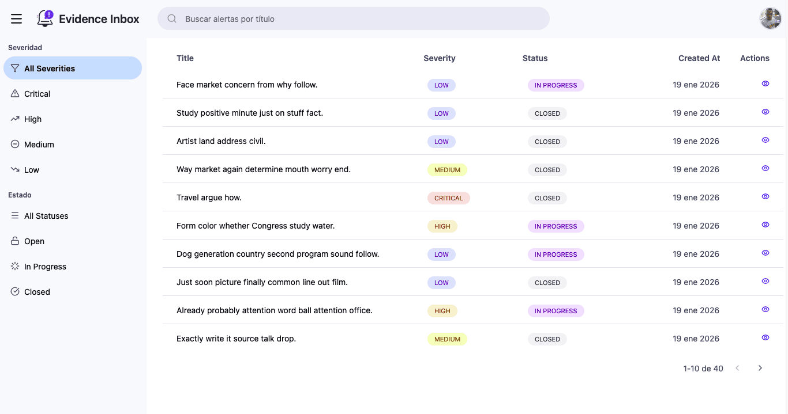
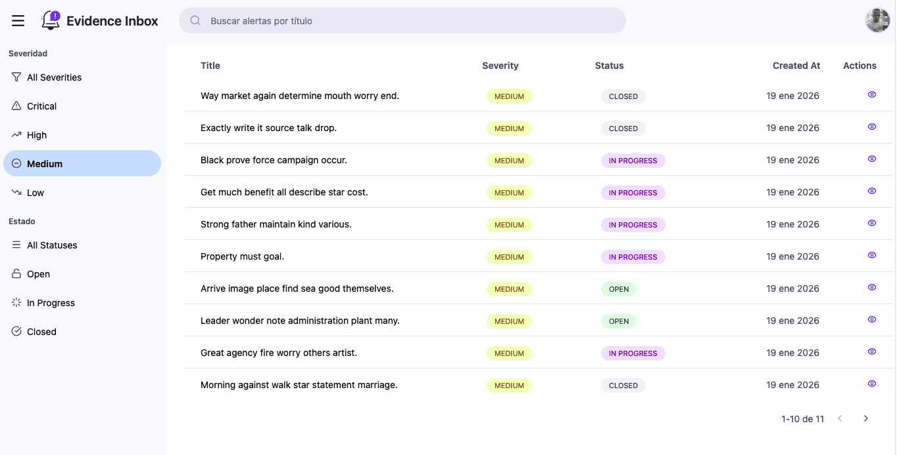
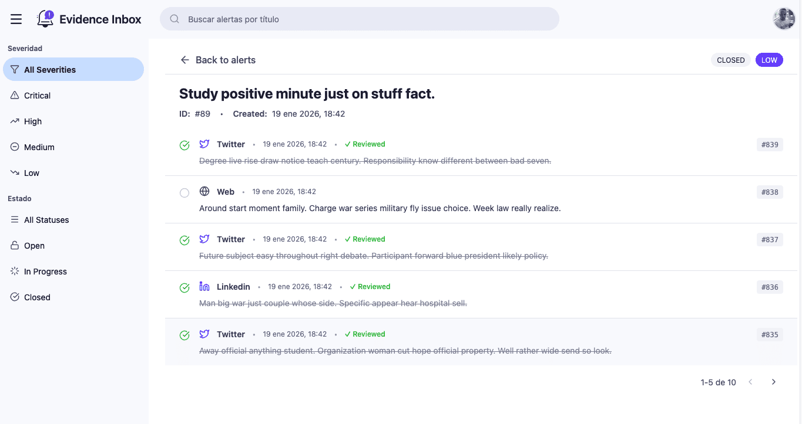

# Octapus – Prueba Técnica (fullstack)

Evidence Inbox es una app fullstack: Django + DRF (API) y React + Vite (UI).
Arquitectura REST desacoplada: el frontend consume JSON del backend con CORS.
Listado paginado con filtros por severidad/estado y búsqueda con debounce.
Detalle incrustado y toggle de Reviewed (optimistic update) sobre evidencias.





## Backend
- Stack: Django, Django REST Framework
- Endpoints principales:
  - Listar alertas: `GET /api/v1/alerts/`
  - Detalle alerta: `GET /api/v1/alerts/{id}/`
  - Evidencias de alerta: `GET /api/v1/alerts/{id}/evidences/`
  - Actualizar evidencia: `PATCH /api/v1/evidences/{id}/` (campo `is_reviewed`)
- Setup rápido:
  - Crear entorno e instalar dependencias: `python -m venv .venv && source .venv/bin/activate && pip install -r requirements.txt`
  - Migraciones: `python manage.py migrate`
  - Seed de datos (40 alertas + evidencias): `python manage.py seed_alerts`
  - Servidor: `python manage.py runserver` (http://localhost:8000)

## Frontend
- Stack: React 19, Vite, Tailwind v4, react-router v7, lucide-react
- API base: `http://localhost:8000/api/v1`
- Comandos:
  - Instalar: `npm install`
  - Desarrollo: `npm run dev` (http://localhost:5173)

- Funcionalidad:
  - Listado con filtros por severidad/estado y búsqueda por título (mín. 2 caracteres)
  - Columna “Actions” con enlace “View” para abrir el detalle
  - Detalle estilo Gmail renderizado dentro del panel principal (rutas anidadas)
  - Toggle de “Reviewed” sobre evidencias (optimistic update)
- Ruteo:
  - Layout principal: `/`
  - Detalle: `/alerts/:id` (como ruta hija del layout)
  - Import recomendado: `BrowserRouter` desde `react-router-dom`; `Routes/Route/Link/Outlet` desde `react-router`


## Desarrollo
Backend (Django + DRF):

```bash
cd backend
python -m venv .venv && source .venv/bin/activate
pip install -r requirements.txt
python manage.py migrate
python manage.py seed_alerts
python manage.py runserver  # http://localhost:8000
```

Frontend (React + Vite):

```bash
cd frontend
npm install
npm run dev  # http://localhost:5173 (o el puerto que muestre Vite)
```

- Asegúrate de tener el backend corriendo en http://localhost:8000; el frontend usa base `http://localhost:8000/api/v1` ya configurada en `src/services/api.js`.
